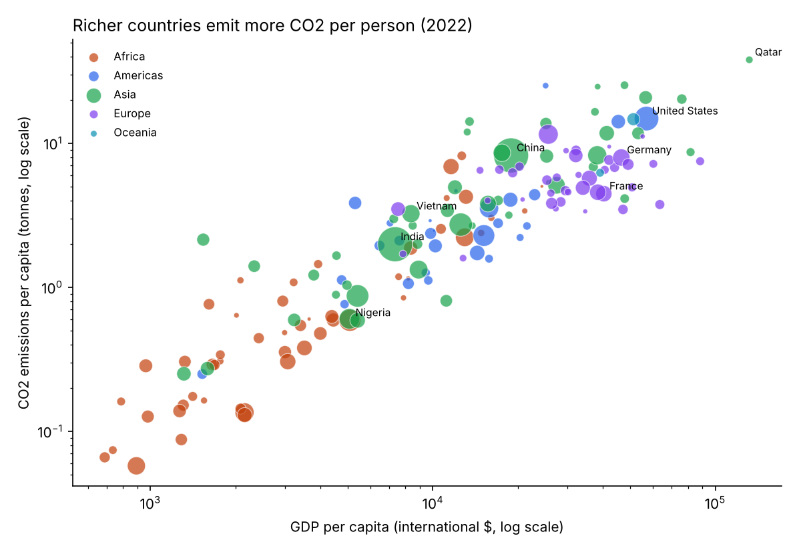
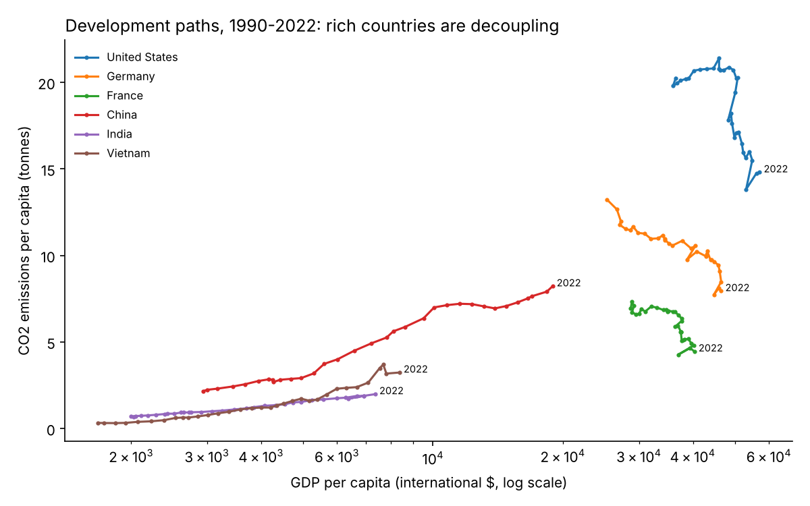
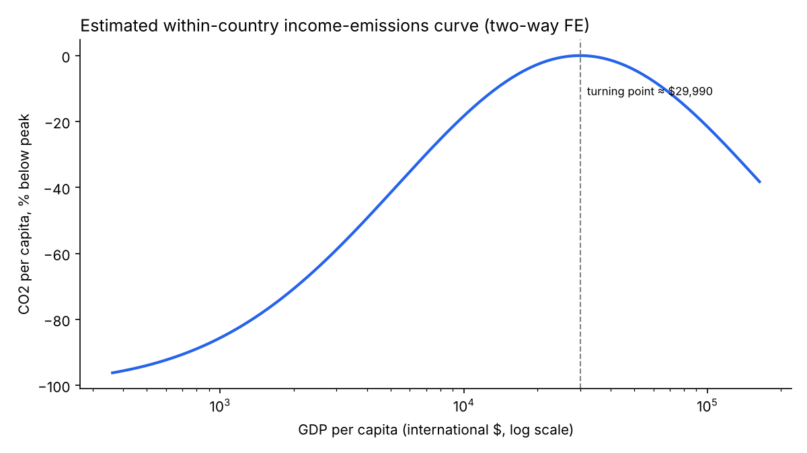

# CO2 Emissions and Economic Development

Do countries pollute less once they get rich enough? This project tests the
**Environmental Kuznets Curve** (an inverted-U relationship between income and
pollution) on a panel of 164 countries from 1990 to 2022.

## Data

| Source | Content | File |
|---|---|---|
| [Our World in Data – CO2 dataset](https://github.com/owid/co2-data) | CO2 emissions, GDP, population by country and year | `data/raw/owid-co2-data.csv` (downloaded automatically on first run) |
| [ISO-3166 countries with regional codes](https://github.com/lukes/ISO-3166-Countries-with-Regional-Codes) | World region of each country | `data/raw/regions.csv` |

## Pipeline (`src/analysis.py`)

1. **Clean**: keep real countries (drop aggregates like "World"), restrict to 1990–2022, drop missing values, check for duplicates and negative values.
2. **Build variables**: GDP per capita, CO2 per capita (tonnes), logs. Computed CO2 per capita is cross-checked against the OWID figure.
3. **Merge** with world regions on the ISO code, with a validated many-to-one merge and a check for unmatched countries.
4. **Descriptive statistics** by region (`outputs/tables/`).
5. **Figures** (`outputs/figures/`).
6. **Regressions**: `log(CO2 pc) = b1·log(GDP pc) + b2·log(GDP pc)² + fixed effects`, with standard errors clustered by country.

## Results

| | (1) Pooled OLS | (2) Two-way FE |
|---|---|---|
| Fixed effects | Year | Country + Year |
| log GDP pc | 3.90 (0.47) | 3.45 (0.45) |
| log GDP pc² | −0.149 (0.026) | −0.168 (0.023) |
| Turning point (GDP pc) | ~$475,000 | ~$30,000 |
| Observations | 5,409 | 5,409 |

Clustered standard errors in parentheses.

- Across countries, richer means more CO2 per person, and the curve only bends at income levels almost no country reaches (model 1).
- **Within** countries over time (model 2), emissions per person peak around **$30,000** of GDP per capita and then decline: this is the decoupling visible for the US, Germany and France in Figure 2.
- Limits: this is a correlation, not a causal effect. Rich countries may have moved emissions abroad through trade (production-based CO2 only), and the result is sensitive to the functional form.





## Reproduce

```bash
pip install -r requirements.txt
python src/analysis.py
```

## Next steps

- Use consumption-based CO2 to account for emissions embedded in imports.
- Add satellite-based measures (e.g. night lights as an alternative income proxy, or forest cover loss).
